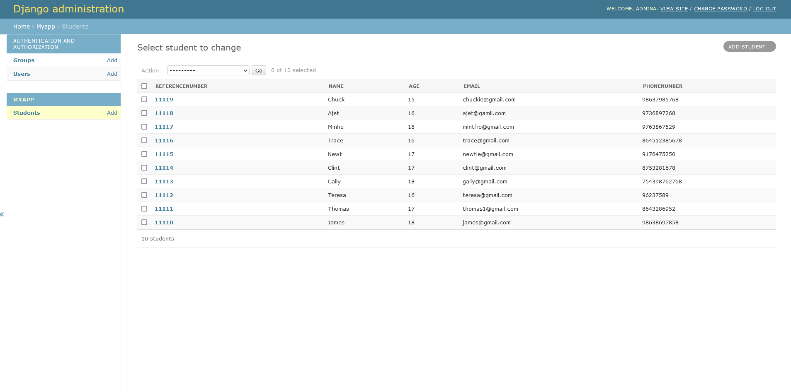
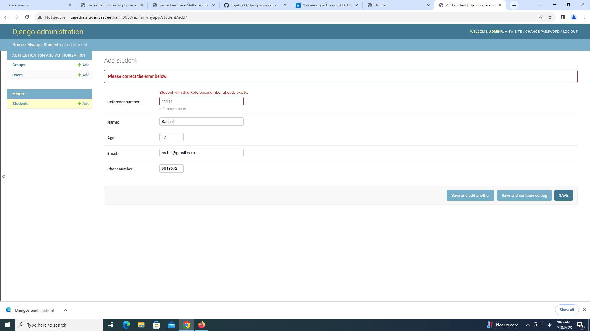

# Django ORM Web Application

## AIM
To develop a Django application to store and retrieve data from a database using Object Relational Mapping(ORM).

## Entity Relationship Diagram

## DESIGN STEPS

### STEP 1: 
First make a folder where git is needed to be created. example:ex02. Fork the repository and clone it inside the folder ex02. After cloning the folder with the repository name django-orm-app, move into that folder and give the commands python3 manage.py startapp myapp to create myapp, then change the necessary settings in settings.py

### STEP 2:
Create models.py using the necessary programs and admins.py using the commands given in program

### STEP 3:
Make migrations using the command $ python3 manage.py makemigrations and $ python3 manage.py migrate.
then create a superuser using the command $ python3 manage.py createsuperuser.
After creating superuser visit the admin app at http://url:8000/admin and create the users.
Then do the git configuration using the git commands to post the repository in github.

## PROGRAM

# TO CREATE models.py:

from django.db import models
from django.comtrib import admin
#Create your models here
class Student (models.Model):
    referencenumber=models.CharField(primary_key=True,max_length=20,help_text="reference number")
    name=models.CharField(max_length=100)
    age=models.IntegerField()
    email=models.EmailField()
    phonenumber=models.IntegerField(max_length=10)

class StudentAdmin(admin.ModelAdmin):
    list_display=('referencenumber','name','age','email','phonenumber')

# TO CREATE admins.py

from django.contrib import admin
from .models import Student,StudentAdmin

#Register your models here.
admin.site.register(Student,StudentAdmin)

## OUTPUT

### Django Student

### Primary key error

## RESULT

Thus the Django application is stored and the datas are in a retrievable state from the database